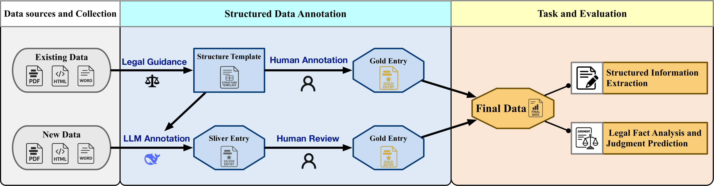
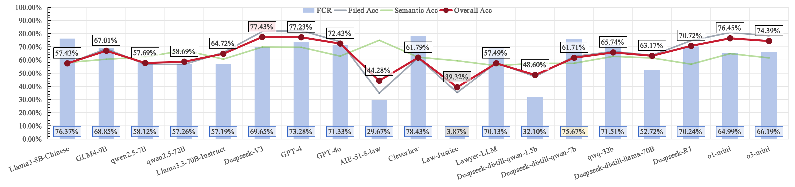
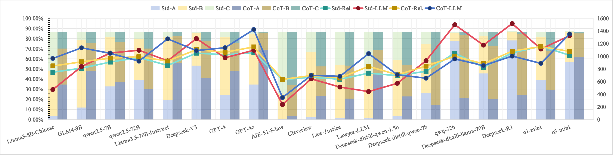

# LawDual-Bench: A Dual-Task Benchmark and Chain-of-Thought Impact Study for Legal Outcomes
With the rapid development of Large Language Models (LLMs) in legal applications, it has become increasingly urgent to systematically evaluate their **reasoning capabilities in legal document processing and judgment prediction**. Currently available legal benchmarks lack a unified evaluation framework and offer limited support for these two core tasks. To address this gap, we introduce **LawDual-Bench**, which fills a critical void in structured reasoning evaluation within Chinese legal NLP, and provides a solid foundation for evaluating and optimizing legal-domain LLM systems. For more details, please refer to our paper.

## 📄 Introduction
LawDual-Bench is meticulously designed to enable precise evaluation of LLMs' capabilities in **legal document understanding and case reasoning**. We propose a semi-automated dataset construction approach that combines **manual annotation and LLM assistance**, resulting in a comprehensive insider trading dataset. This approach also allows for easy scalability in both dataset size and diversity of case types.

Based on this dataset, we define two key tasks: **Structured Information Extraction** and **Case Fact Analysis with Judgment Prediction**. To thoroughly assess model performance on these tasks, we designed a set of detailed and diverse evaluation metrics, yielding **accurate and comprehensive** results.

Additionally, we developed a **high-quality Chain-of-Thought (CoT) reasoning path** with the help of legal experts. This enables us to test whether model reasoning improves when guided by an explicit reasoning chain and whether it aligns more closely with human judicial processes.

## 📖 Data Sources and Construction Process

### Data Sources
The data in LawDual-Bench is primarily collected from the following three public sources, focusing on **insider trading cases** from 2005 to 2024. It covers various legal stages, including administrative, criminal, and non-prosecution cases:

- Administrative penalty decisions issued by the China Securities Regulatory Commission (CSRC);
- Criminal judgments published on China Judgments Online;
- Non-prosecution decisions publicly released by national procuratorates.

Each original legal document was obtained in `.docx`, `.pdf`, or `.html` format and converted into standardized structured text for unified processing. Key metadata such as **document ID, decision date, and source URL** were recorded. Public documents that lacked specific case descriptions or outcomes were excluded, retaining only valid entries.

### Structured Data Design
In collaboration with legal experts, we developed a unified schema of structured fields (see `data/schema.json`), covering six major dimensions: identification of insider information, basic information of involved parties, trading behavior, calculation of illicit gains, applicable legal provisions, and final penalties. All fields are strictly aligned with relevant laws including the *Securities Law of the People’s Republic of China*, the *Criminal Law*, and the *Civil Code*, ensuring **legal consistency, semantic comparability**, and strong support for structured judicial reasoning.

### Data Annotation Process
#### Manual Annotation
In the initial phase, we conducted item-by-item manual annotation on **over 1,000 real case documents**, resulting in more than **50,000 structured fields** annotated. The annotation was performed by legal professionals following a standardized schema, with a **cross-check and random quality inspection mechanism** to ensure consistency and accurate legal interpretation.

#### LLM-Assisted Extraction + Human Verification
After building a high-quality seed set, we extended the dataset with **more than 400 additional case documents (2020–2024)**. Based on comparative experiments across different LLM extraction strategies, we selected DeepSeek-V3 for its superior performance and cost-efficiency as the automated extraction tool. To enhance its performance on legal tasks, we specially optimized the extraction prompt templates. All automatically extracted outputs were **manually verified field-by-field** by legal experts to ensure structural completeness and semantic accuracy.



### Data Overview

| Metric | Value |
|--------|-------|
| Time Span | 2005–2024 |
| Total Number of Cases | 1,389 |
| Average Number of Fields per Document | 43.03 |
| Total Number of Structured Field Entries | 59,771 |
| Average Completion Rate of Core Fields | 86.58% |

### Data Format
All raw and structured data is stored in the `data` folder. The processed data is saved in JSON format under `data/processed`, and can be loaded using `json.load`. The `input.json` file consolidates the input portions from each individual JSON file, making it convenient for users to access and utilize.

## 🧩 Dual-Task Definition

### Task 1: Structured Information Extraction

This task aims to extract standardized key fields from legal case description paragraphs, simulating the process by which legal professionals summarize critical elements after reading official documents. The fields include identification of insider information, party details, trading behavior, illicit gains, applicable legal provisions, and final penalties. Detailed field definitions can be found in `data/extract_schema.json`.

- **Input**: Case description segments from original legal documents (natural language text)
- **Output**: Structured JSON format with populated field information
- **Evaluation Metrics**:
  - **Field Accuracy**: Strict exact-match accuracy of field values
  - **Semantic Accuracy**: Accuracy based on semantic similarity of field values
  - **Overall Accuracy**: Weighted composite score combining the above two metrics
  - **Field Completeness Rate (FCR)**: Structural validity and field coverage of the output

📌 For detailed calculation of evaluation metrics, refer to Section 4.1 of the paper.

### Task 2: Legal Reasoning & Judgment Prediction

This task evaluates whether a model can generate logically coherent, structurally complete legal analyses and final judgments based on case descriptions. It assesses the quality of reasoning and coverage of legal elements.

- **Input Modes**:
  - **Standard Input (Std)**: Only the case description is provided; the model is expected to independently perform legal analysis and reach a judgment.
  - **Chain-of-Thought Input (CoT)**: The case description is provided along with structured reasoning prompts, guiding the model to reason in the sequence of "fact identification → legal application → judgment outcome".
- **Output Format**: A complete, natural language legal analysis covering core facts, applicable legal provisions, and judgment conclusions.
- **Evaluation Metrics**:
  - **LLM Score**: Assigned by a high-performing LLM based on logical coherence, completeness, and legal soundness (graded as A/B/C)
  - **Relative Score**: Measures the alignment between the model's output and human-annotated structured fields (field-level matching)

📌 For details on evaluation procedures and scoring standards, refer to Section 4.2 of the paper.

#### CoT Reasoning Template Construction
A high-quality Chain-of-Thought (CoT) prompt template was designed by professional legal practitioners to guide models through step-by-step reasoning processes analogous to real-world judicial practice in insider trading cases.

The design references relevant provisions from the *Criminal Law of the People’s Republic of China*, *Civil Code*, and *Securities Law*, ensuring **legal rigor and authoritative expression**. Legal experts with years of trial experience participated in the template construction, abstracting the common reasoning paths followed by judicial authorities in insider trading adjudications.

```text
Insider Information Formation → Information Awareness → Trading Behavior → Illicit Gains → Legal Application → Penalty Decision
```

## 📊 Experimental Results

In our experiments, we evaluated the performance of three major categories of models on the two defined tasks.
In addition, we provide a set of example outputs from different models under the same input case in the `example/` directory, offering an intuitive comparison of how various models perform in real-world legal text processing and revealing their respective strengths and limitations.

### Evaluated Models
- **General-purpose LLMs**: Models such as GPT-4, Qwen2.5, GLM4, and DeepSeek-V3, which possess broad capabilities in text understanding and generation;
- **Legal-domain LLMs**: Models like CleverLaw and Lawyer-LLM, fine-tuned on legal corpora for enhanced domain-specific performance;
- **Reasoning-augmented LLMs**: Models such as DeepSeek-R1 and QwQ-32B, which incorporate slow and fast thinking mechanisms to strengthen reasoning ability.

### Comparative Performance of Model Categories on Task 1 (Structured Information Extraction)

| Category         | Model                     | Filed Acc | Semantic Acc | Overall Acc | FCR      |
|------------------|---------------------------|-----------|---------------|--------------|----------|
| **General LLMs** | Llama3-8B-Chinese         | 57.24%    | 58.06%        | 57.43%       | **76.37%** |
|                  | GLM4-9B                   | 68.49%    | 60.59%        | 67.01%       | 68.85%   |
|                  | Qwen2.5-7B                | 56.65%    | 62.22%        | 57.69%       | 58.12%   |
|                  | Qwen2.5-72B               | 56.68%    | 67.37%        | 58.69%       | 57.26%   |
|                  | Llama3.3-70B-Instruct     | 65.66%    | 60.64%        | 64.72%       | 57.19%   |
|                  | Deepseek-V3               | 81.64%    | **69.83%**    | **77.43%**   | 69.65%   |
|                  | GPT-4                     | **82.36%**| 69.62%        | 77.23%       | 73.28%   |
|                  | GPT-4o                    | 73.84%    | 62.92%        | 72.43%       | 71.33%   |
| **Legal LLMs**   | AIE-51-8-law              | 34.84%    | **74.97%**    | 44.28%       | 29.67%   |
|                  | Cleverlaw                 | **61.71%**| 62.11%        | **61.79%**   | **78.43%** |
|                  | Law-Justice               | 35.30%    | 59.41%        | 39.32%       | 3.87%    |
|                  | Lawyer-LLM                | 57.87%    | 55.70%        | 57.49%       | 70.13%   |
| **Reasoning LLMs**| Deepseek-distill-qwen-1.5b| 47.42%   | 57.48%        | 48.60%       | 32.10%   |
|                  | Deepseek-distill-qwen-7b  | 62.66%    | 57.57%        | 61.71%       | **75.67%** |
|                  | Qwq-32b                   | 66.43%    | 62.73%        | 65.74%       | 71.51%   |
|                  | Deepseek-distill-llama-70B| 63.50%    | 61.51%        | 63.17%       | 52.72%   |
|                  | Deepseek-R1               | 74.69%    | 56.83%        | 70.72%       | 70.24%   |
|                  | GPT-o1-mini               | **80.89%**| **64.82%**    | **76.45%**   | 64.99%   |
|                  | GPT-o3-mini               | 78.35%    | 61.59%        | 74.39%       | 66.19%   |

### Comparison of Standard Output vs. CoT Output for Each Model on Task 2 (Legal Reasoning & Judgment Prediction)


| Category         | Model               | Std Rel. | Std LLM | A (Std) | B (Std) | C (Std) | CoT Rel. | CoT LLM | A (CoT) | B (CoT) | C (CoT) | ΔRel. | ΔLLM  |
|------------------|---------------------|----------|----------|---------|---------|---------|-----------|----------|---------|---------|---------|--------|--------|
| **General LLMs** | Llama3-8B-Chinese   | 46.76%   | 29.63%   | 58      | 707     | 624     | 52.93%    | 60.37%   | 554     | 569     | 266     | 6.17%  | 30.74% |
|                  | GLM4-9B             | 50.79%   | 52.38%   | 191     | 1073    | 125     | 57.00%    | 70.88%   | 763     | 443     | 183     | 6.21%  | 18.50% |
|                  | Qwen2.5-7B          | 56.78%   | 65.73%   | 522     | 782     | 85      | 60.70%    | 65.44%   | 593     | 632     | 164     | 3.92%  | -0.29% |
|                  | Qwen2.5-72B         | 61.25%   | 68.50%   | 628     | 647     | 114     | 62.09%    | 57.70%   | 479     | 645     | 265     | 0.84%  | -10.80% |
|                  | Llama3-70B-Instruct | 53.47%   | 58.06%   | 309     | 995     | 85      | 57.87%    | 79.73%   | 892     | 431     | 66      | 4.40%  | 21.67% |
|                  | Deepseek-V3         | **65.66%**| **79.99%**| 854   | 514     | 21      | 69.00%    | 68.11%   | 651     | 590     | 148     | 3.34%  | -11.88% |
|                  | GPT-4               | 63.99%   | 61.09%   | 390     | 917     | 82      | 66.46%    | 70.99%   | 764     | 444     | 181     | 2.47%  | 9.90%  |
|                  | GPT-4o              | 66.06%   | 68.47%   | 554     | 794     | 41      | **71.78%**| **88.98%**| 1097   | 278     | 14      | 5.72%  | 20.52% |
| **Legal LLMs**   | AIE-51-8-law        | 39.41%   | 14.90%   | 6       | 402     | 981     | 39.65%    | 21.74%   | 61      | 482     | 846     | 0.24%  | 6.84%  |
|                  | Cleverlaw           | 41.86%   | 40.21%   | 46      | 1025    | 318     | 43.48%    | 43.63%   | 371     | 470     | 548     | 1.62%  | 3.42%  |
|                  | Law-Justice         | 39.83%   | 32.11%   | 26      | 840     | 523     | 41.06%    | 42.69%   | 333     | 520     | 536     | 1.23%  | 10.58% |
|                  | Lawyer-LLM          | **45.86%**| **27.65%**| 29    | 710     | 650     | **52.56%**| **65.15%**| 712     | 386     | 291     | 6.70%  | 37.51% |
| **Reasoning LLMs**| Deepseek-qwen-1.5b | 43.38%   | 35.82%   | 52      | 891     | 446     | 44.24%    | 44.28%   | 364     | 520     | 523     | 0.86%  | 8.46%  |
|                  | Deepseek-qwen-7b    | 47.70%   | 58.14%   | 415     | 785     | 189     | 52.88%    | 40.86%   | 223     | 689     | 477     | 5.18%  | -17.28% |
|                  | Qwq-32b             | 65.74%   | **93.70%**| 1237  | 129     | 23      | 62.54%    | 59.90%   | 334     | 996     | 59      | -3.20% | -33.96% |
|                  | Deepseek-llama-70B  | 51.72%   | 73.54%   | 729     | 585     | 75      | 55.05%    | 53.31%   | 323     | 835     | 231     | 3.33%  | -20.23% |
|                  | Deepseek-R1         | 65.81%   | **94.82%**| 1251  | 132     | 6       | 67.61%    | 62.71%   | 388     | 966     | 35      | 1.80%  | -32.11% |
|                  | GPT-o1-mini         | **72.49%**| 69.69%   | 631     | 674     | 84      | 72.08%    | 55.51%   | 462     | 618     | 309     | -0.41% | -14.18% |
|                  | GPT-o3-mini         | 63.55%   | 82.87%   | 915     | 472     | 2       | 67.37%    | **84.52%**| 986    | 376     | 27      | 3.82%  | 1.66%  |

## 🔧 How to Evaluate Models

This project provides a high-quality, structured Chinese legal judgment benchmark covering the dual tasks of “Structured Information Extraction” and “Legal Reasoning & Judgment Prediction”, and evaluates the impact of Chain-of-Thought prompting on model reasoning performance.

### Environment Setup
1. **Python Version:** Python ≥ 3.10 is recommended
2. **Install Dependencies**
```bash
pip install -r requirements.txt
```
3. **Prepare Model Files:**
   - Place the large language model files or configurations to be evaluated in the `model/` directory
   - Download the Chinese legal semantic embedding model ChatLaw-Text2Vec and place it in the `embedding_model/` directory for use in semantic similarity computation

## Task Execution Workflow

### Run Task 1: Structured Information Extraction
```bash
python script/task1_extract.py \
  --model_path /path/to/model \
  --data_path ./data/input_data.json \
  --output_dir ./output/task1
```

### Run Task 2: Legal Reasoning & Judgment Prediction
```bash
python script/task2_predict.py \
  --model_path /path/to/model \
  --data_path ./data/input_data.json \
  --output_dir ./output/task2
```
> During the execution of Task 2, both Std and CoT outputs will be saved together in the output JSON file. If you wish to modify the CoT prompt, please edit the prompt directly in the corresponding Python script.

### Model Evaluation Scripts

#### Evaluate Task 1: Structured Information Extraction

**1. Overall Score (Field Accuracy + Semantic Similarity)** 
```bash
python script/evaluate_Overall_task1.py \
  --gold_file data/processed \
  --pred_file output/task1 \
  --embedding_model embedding_model/ChatLaw-Text2Vec \
  --semantic_threshold 0.6
```

**2. FRC Score (Field Completeness Rate)**
```bash
python script/evaluate_FRC_task1.py \
  --data_dir ./output/task1 \
  --gold_dir ./data/processed
```

#### Evaluate Task 2: Legal Reasoning & Judgment Prediction

**1. LLM Score (Reasoning Quality Rating A/B/C, reviewed by a model)**
```bash
python script/evaluate_LLMScore_task2.py \
  --gold_dir data/processed \
  --pred_dir output/task2 \
  --eval_scores_path result/llm_score_eval.json
```
**2. Relative Score (Consistency of Reasoning Output with Structured Fields)**
```bash
python script/evaluate_RelScore_task2.py \
  --gold_dir data/processed \
  --pred_dir output/task2 \
  --embedding_model embedding_model/ChatLaw-Text2Vec \
  --threshold 0.6 \
  --output_path result/relscore_task2.json
```

## 📎 Citation

If you use the LawDual-Bench dataset or code, please cite our paper:

```bibtex
@inproceedings{LawDualBench2025,
  title={LawDual-Bench: A Dual-Task Benchmark and Chain-of-Thought Impact Study for Legal Outcomes},
  author={Anonymous},
  booktitle={},
  year={2025}
}
```

## 🛡️ Disclaimer

All legal data in LawDual-Bench is collected from publicly available sources and has been strictly anonymized. It is intended for research purposes only and must not be used for actual legal decision-making.